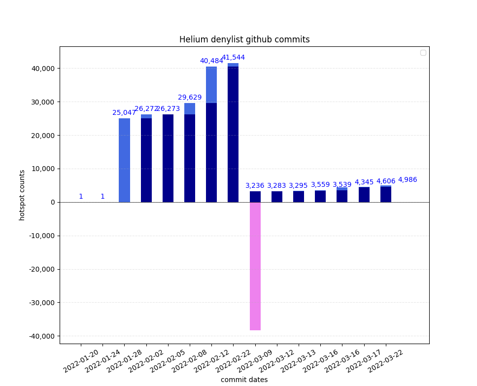

# Helium denylist Monitor

## Background

Location spoofing has been a problem for the Helium network from the start. Scammers are tricking the Proof-of-Coverage algorithm and earning big rewards for their hotspots while everyone knows what’s going on. Helium’s (temporary?) solution, launched in January 2022, is a [denylist](https://github.com/helium/denylist) with known fake hotspots, relying on the public to request Additions or Removals to the list. The list is growing rapidly, with over a thousand [open issues](https://github.com/helium/denylist/issues). At the end of Feb 2022, close to 7% of [all Helium hotspots](https://explorer.helium.com/) were on the denylist. Then on 9 March 2022 over 90% were taken off the denylist, with [this explanation](https://github.com/helium/denylist/pull/2225).

## Monitoring the denylist

The Helium team processes the Addition/Removal issues in batches, and has been releasing new denylists every week or so. This [script](monitor_denylist.py) tracks the changes by cloning the github repository, and loading the different versions of the denylist to compare with the previous version.

* Previous: hotspots already included in the previous denylist
* Additions: hotspots newly added (relative to the previous denylist) 
* Removals: hotspots removed from the previous denylist (so few that the don't show up yet on the bar graph)

Status on 24 March 2022 (as in above bar graph)

|hash|date|size|new|old|removed|name|
|:---|:-----------|---:|---:|---:|---:|:---|
| b52ad8e | 2022-01-20 | 1 | 0 | 0 | 0 | initial README |
| 8ec9385 | 2022-01-24 | 1 | 0 | 0 | 0 | Initial Instructions for maintainers/signers (#3) |
| 69b8e1c | 2022-01-28 | 25,047 | 25,047 | 0 | 1 | 2022012601 (#21) |
| 0b2b24e | 2022-02-02 | 26,272 | 1,256 | 25,016 | 31 | 2022020201 (#170) |
| 78e34c2 | 2022-02-05 | 26,273 | 1 | 26,272 | 0 | 2022020501 (#339) |
| 18a64b8 | 2022-02-08 | 29,629 | 3,377 | 26,252 | 21 | Updates to the denylist (#409) |
| 5545cb2 | 2022-02-12 | 40,484 | 10,855 | 29,629 | 0 | 2022021201 (#684) |
| d15fae0 | 2022-02-22 | 41,544 | 1,060 | 40,484 | 0 | 20220222 (#1474) |
| a8ab883 | 2022-03-09 | 3,236 | 0 | 3,236 | 38,308 | 20220309 (#2225) |
| c1f6e35 | 2022-03-12 | 3,283 | 47 | 3,236 | 0 | 2022031101 (#2323) |
| cf2d9d8 | 2022-03-13 | 3,295 | 12 | 3,283 | 0 | 2022031201 (#2340) |
| a9317f8 | 2022-03-16 | 3,559 | 264 | 3,295 | 0 | 2022031601 (#2433) |
| 02b5f37 | 2022-03-16 | 3,539 | 0 | 3,539 | 20 | 2022031501 (#2432) |
| 5f4051f | 2022-03-17 | 4,345 | 806 | 3,539 | 0 | 2022031801 (#2471) |
| bf17ce7 | 2022-03-22 | 4,606 | 262 | 4,344 | 1 | 2022032001 (#2606) |
| 8221d74 | 2022-03-23 | 4986 | 380 | 4,606 | 0 | 2022032201 (#2659) |

## Installation
To use this script, you will have to clone the Helium [denylist](https://github.com/helium/denylist) repo, and point the `GIT_DIR` variable in the script to your denylist folder.

The script starts with `git pull` to update your local denylist repo. Then it looks for the different commits of `denylist.csv` and loads them in a list to compare each denylist with the previous one.

Note that this does NOT access the Helium blockchain API; the denylist is only used in the Proof-of-Coverage system running on hotspots, at the discretion of hotspot manufacturers.

## Disclaimer
It is very well possible that mistakes were made in the script and in the above interpretation, I am open to corrections and suggestions.

I got interested in Helium when I saw dozens of hotspots appearing in my area, which all turned out to be fake. I am trying to contribute to [mapping](https://cassiopeia.hk/finding-real-helium-hotspots-in-hong-kong) of real Helium network coverage in Hong Kong, and I remain a big fan of The Things Network.

