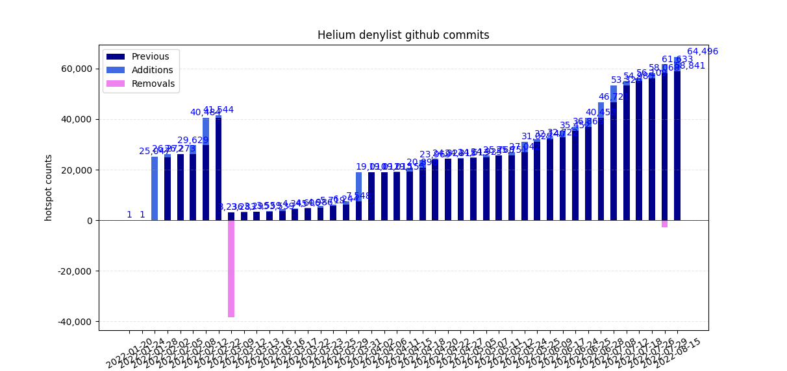

# Helium denylist Monitor

## Background

Location spoofing has been a problem for the Helium network from the start. Scammers are tricking the Proof-of-Coverage algorithm and earning big rewards for their hotspots while everyone knows what’s going on. Helium’s (temporary?) solution, launched in January 2022, is a [denylist](https://github.com/helium/denylist) with known fake hotspots, relying on the public to request Additions or Removals to the list. The list was growing rapidly, and included up to 7% of [all Helium hotspots](https://explorer.helium.com/) at the end of Feb 2022. Then on 9 March 2022 over 90% were taken off the denylist, with [this explanation](https://github.com/helium/denylist/pull/2225). For what it's worth, that's very soon after the Series D funding was announced on 19 Feb 2022. The list has been growing fast, with over 2,500 [open issues](https://github.com/helium/denylist/issues). Currently mid August 2022, again 7% of all reported Helium hotspots are on the denylist.

## Monitoring the denylist

The Helium team processes the Addition/Removal issues in batches, and has been releasing new denylists every week or so. This [script](monitor_denylist.py) tracks the changes by cloning the github repository, and loading the different versions of the denylist to compare with the previous version.

* Previous: hotspots already included in the previous denylist
* Additions: hotspots newly added (relative to the previous denylist) 
* Removals: hotspots removed from the previous denylist (so few that the don't show up yet on the bar graph)

Status on 19 Aug 2022 (as in above bar graph)

|hash|date|size|new|old|removed|name|
|:---|:-----------|---:|---:|---:|---:|:---|
| b52ad8e | 2022-01-20 | 1 | 0 | 0 | 0 | initial README |
| 8ec9385 | 2022-01-24 | 1 | 0 | 0 | 0 | Initial Instructions for maintainers/signers (#3) |
| 69b8e1c | 2022-01-28 | 25,047 | 25,047 | 0 | 1 | 2022012601 (#21) |
| 0b2b24e | 2022-02-02 | 26,272 | 1,256 | 25,016 | 31 | 2022020201 (#170) |
| 78e34c2 | 2022-02-05 | 26,273 | 1 | 26,272 | 0 | 2022020501 (#339) |
| 18a64b8 | 2022-02-08 | 29,629 | 3,377 | 26,252 | 21 | Updates to the denylist (#409) |
| 5545cb2 | 2022-02-12 | 40,484 | 10,855 | 29,629 | 0 | 2022021201 (#684) |
| d15fae0 | 2022-02-22 | 41,544 | 1,060 | 40,484 | 0 | 20220222 (#1474) |
| a8ab883 | 2022-03-09 | 3,236 | 0 | 3,236 | 38,308 | 20220309 (#2225) |
| c1f6e35 | 2022-03-12 | 3,283 | 47 | 3,236 | 0 | 2022031101 (#2323) |
| cf2d9d8 | 2022-03-13 | 3,295 | 12 | 3,283 | 0 | 2022031201 (#2340) |
| a9317f8 | 2022-03-16 | 3,559 | 264 | 3,295 | 0 | 2022031601 (#2433) |
| 02b5f37 | 2022-03-16 | 3,539 | 0 | 3,539 | 20 | 2022031501 (#2432) |
| 5f4051f | 2022-03-17 | 4,345 | 806 | 3,539 | 0 | 2022031801 (#2471) |
| bf17ce7 | 2022-03-22 | 4,606 | 262 | 4,344 | 1 | 2022032001 (#2606) |
| 8221d74 | 2022-03-23 | 4986 | 380 | 4,606 | 0 | 2022032201 (#2659) |
| c618e37 | 2022-03-25 | 5719 | 733 | 4986 | 0 | 2022032501 (#2734) |
| 377d93f | 2022-03-29 | 6244 | 525 | 5719 | 0 | 2022032801 (#2783) |
| 93eebba | 2022-03-31 | 7548 | 1304 | 6244 | 0 | 2022033001 (#2845) |
| 97765c2 | 2022-04-02 | 19010 | 11464 | 7546 | 2 | 2022040101 (#2896) |
| 7c5d8a7 | 2022-04-06 | 19012 | 2 | 19010 | 0 | 2022040501 (#3082) |
| 95a6e1e | 2022-04-11 | 19015 | 3 | 19012 | 0 | 2022041101 (#3464) |
| 6f3240c | 2022-04-15 | 19155 | 140 | 19015 | 0 | 2022041501 (#3629) |
| 6517634 | 2022-04-18 | 20898 | 1743 | 19155 | 0 | 2022041801 (#3847) |
| 84e0f9a | 2022-04-20 | 23969 | 3072 | 20897 | 1 | 2022041901 (#4048) |
| 73ed6f6 | 2022-04-22 | 24324 | 367 | 23957 | 12 | 2022042201 (#4175) |
| 5b84dc0 | 2022-04-27 | 24315 | 0 | 24315 | 9 | 2022042301 (#4238) |
| 4d7e05c | 2022-05-05 | 24613 | 334 | 24279 | 36 | 2022050501 (#4381) |
| fb77695 | 2022-05-07 | 24925 | 312 | 24613 | 0 | 2022050701 (#4734) |
| ded92a3 | 2022-05-11 | 25768 | 844 | 24924 | 1 | 2022050802 (#4814) |
| 42ce863 | 2022-05-12 | 25751 | 0 | 25751 | 17 | 2022051101 (#4936) |
| aca3075 | 2022-05-24 | 27042 | 1292 | 25750 | 1 | 2022051701 (#5071) |
| 65d3f91 | 2022-05-25 | 31029 | 3997 | 27032 | 10 | 2022052502 (#5329) |
| 18d37f9 | 2022-06-09 | 32140 | 1123 | 31017 | 12 | 2022060701 (#5411) |
| 487b9e0 | 2022-06-17 | 32722 | 577 | 32145 | -5 | 2022061701 (#5937) |
| 992ff26 | 2022-06-24 | 35452 | 2749 | 32703 | 19 | 2022062301 (#5982) |
| a8c487d | 2022-06-25 | 36869 | 1447 | 35422 | 30 | 2022062401 (#6020) |
| ca60361 | 2022-06-28 | 40453 | 3602 | 36851 | 18 | 2022062702 (#6105) |
| 83e1049 | 2022-07-08 | 46721 | 6274 | 40447 | 6 | 2022070701 (#6369) |
| 49c7331 | 2022-07-12 | 53326 | 6612 | 46714 | 7 | 2022071002 (#6532) |
| 24ee479 | 2022-07-18 | 54985 | 1709 | 53276 | 50 | 2022071501 (#6629) |
| c3c4df4 | 2022-07-26 | 56109 | 1124 | 54985 | 0 | 2022072002 (#6902) |
| 43b00f2 | 2022-07-29 | 58068 | 1959 | 56109 | 0 | 2022072601 (#7030) |
| ea29736 | 2022-08-15 | 61633 | 3565 | 58068 | 0 | 2022081501 (#7251) |
| 9c6b063 | 2022-08-15 | 58841 | 0 | 58841 | 2792 | 2022072902 (#7082) |
| b8fbd89 | 2022-08-18 | 64496 | 5670 | 58826 | 15 | 2022081601 (#7254) |

## Installation
To use this script, you will have to clone the Helium [denylist](https://github.com/helium/denylist) repo, and point the `GIT_DIR` variable in the script to your denylist folder.

The script starts with `git pull` to update your local denylist repo. Then it looks for the different commits of `denylist.csv` and loads them in a list to compare each denylist with the previous one.

Note that this does NOT access the Helium blockchain API; the denylist is only used in the Proof-of-Coverage system running on hotspots, at the discretion of hotspot manufacturers.

## Disclaimer
It is very well possible that mistakes were made in the script and in the above interpretation, I am open to corrections and suggestions.

## Personal note
I got interested in Helium when I saw dozens of hotspots appearing in my area, all of them fake until a real one appeared in March 2022. I had been trying to get the fake ones on the denylist, with little success. As a prospective network user, I am interested in real world coverage, and I am very disappointed that cleaning up the fakes is not a higher priority. It would not surprise me if more than half of all hotspots are spoofing their location; the people who are in a position to know this have an obvious interest in pretending all is well and the network is growing.

I am trying to contribute to [mapping](https://cassiopeia.hk/finding-real-helium-hotspots-in-hong-kong) of real Helium network coverage in Hong Kong, and I remain a big fan of The Things Network.

I am also trying to analyse how much [real data](https://github.com/tomtobback/helium-data-traffic) is sent over the Helium network, and as far as I can see only around 20% of the hotspots are seeing real data traffic.

